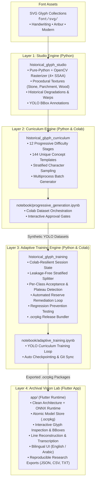

# Old Permic OCR Lab & Archival Vision Ecosystem

[](https://www.python.org/)
[](https://flutter.dev/)
[](https://ultralytics.com)
[](https://onnxruntime.ai/)
[]()
[]()

An end-to-end historical manuscript OCR pipeline and runtime ecosystem for low-resource and ancient writing systems, demonstrated on **Old Permic (Abur / Anbur)** script.

The project integrates synthetic manuscript rendering, 12-stage progressive curriculum generation, adaptive YOLO training with automated remediation, Colab-resilient state orchestration, and an offline-first Flutter research runtime powered by ONNX Runtime.

---

## 🏛️ System Architecture



---

## 📦 Component Breakdown

### 1. Historical Glyph Studio (`lib/historical_glyph_studio`)
*Layer 1: Physical rendering and degradation simulation*

- **SVG Rasterization Engine**: Multi-backend rasterizer prioritizing CairoSVG and svglib, with an embedded **pure-Python + OpenCV bezier path parser** and $4\times$ supersampling fallback.
- **Procedural Manuscript Surfaces**: Procedural generation of realistic physical writing surfaces including aged parchment, stone relief, chiseled wood, plaster, and metal.
- **Historical Degradation Pipeline**:
  - Gaussian blur and optical resolution reduction.
  - Morphological ink erosion and fading.
  - Discriminative-aware occlusion masking (protecting distinct character strokes).
  - JPEG compression artifact modeling and noise injection.
- **Geometric Transformations**: 3D perspective projection, random rotation, affine shear, baseline drift, and non-linear elastic deformations.

### 2. Historical Glyph Curriculum (`lib/historical_glyph_curriculum`)
*Layer 2: Progressive dataset generation*

- **12 Progressive Stages**:
  1. *Stage 01*: Clean Isolated Glyphs (baseline character recognition)
  2. *Stage 02*: Material Variation (paper, stone, wood, metal)
  3. *Stage 03*: Controlled Degradation (blur, erosion, fading)
  4. *Stage 04*: Discriminative-Aware Occlusion
  5. *Stage 05*: Geometric Variation (rotation & perspective tilts)
  6. *Stage 06*: Multiple Glyphs & Adjacent Characters
  7. *Stage 07*: Glyph Groups & Clusters
  8. *Stage 08*: Continuous Text Lines & Baseline Drift
  9. *Stage 09*: Multi-Line Text Blocks
  10. *Stage 10*: Document Structure & Margins
  11. *Stage 11*: Severe Historical Degradation (manuscript weathering)
  12. *Stage 12*: Realistic Mixed Historical Scenes
- **Balanced Character Sampling**: Stratified frequency balancing across Old Permic codepoints ($U+10350$ to $U+1037A$).
- **Parallel Generation Pipeline**: High-throughput multiprocess generation with progress reporting and checksum verification.

### 3. Adaptive Training Engine (`lib/historical_glyph_training`)
*Layer 3: YOLO curriculum training, remediation & packaging*

- **Colab-Resilient Session Management** (`TrainingSession`, `StageState`): Automatic checkpointing, interruption recovery, and audit trail (`audit.jsonl`).
- **Data Splitting & Reserve Pool** (`DatasetSplitter`, `ReservePool`): Stratified 75% train / 15% val / 10% reserve split with zero data leakage across augmentations.
- **Per-Class Evaluator & Plateau Detection** (`Evaluator`, `PlateauDetector`): Validates individual character AP50 and Recall against strict threshold criteria.
- **Targeted Remediation Loop** (`RemediationEngine`): Detects weak classes after each stage and performs up to 3 targeted fine-tuning rounds using unused reserve samples without triggering catastrophic forgetting.
- **Regression Prevention** (`RegressionEvaluator`): Maintains held-out verification subsets across all historical stages to detect performance degradation on earlier scripts.
- **Release Manager** (`ReleaseManager`): Exports trained YOLO models to optimized ONNX format, generates alphabet metadata, validates against Flutter `manifest.json` schema v1, and packages into `.ocrpkg` ZIP bundles.

### 4. Jupyter & Google Colab Notebooks (`notebook/`)

- **`notebook/progressive_generation.ipynb`**: 16-cell interactive notebook for orchestrating the 12-stage synthetic dataset generation in Google Colab with secure token handling and live visual approval gates.
- **`notebook/adaptive_training.ipynb`**: 19-cell production training notebook implementing the full adaptive training loop, plateau monitoring, automated remediation, regression checks, and model publishing.

### 5. Archival Vision Lab (`app/`)
*Layer 4: Generic on-device Flutter OCR runtime*

- **Generic Script Agnostic Core**: Operates on self-describing `.ocrpkg` archives; contains zero hardcoded language assumptions.
- **On-Device ONNX Inference**: High-performance local inference with model-specified input normalization, letterboxing, and YOLO anchor decoding.
- **Atomic Package Store**: Secure candidate staging, SHA-256 integrity verification, safe ZIP extraction, and atomic model activation.
- **Researcher Workspace**: Interactive bounding box review, confidence thresholds, candidate glyph alternatives, and inline transcription correction.
- **Bilingual Support**: Native English and Arabic localization catalogs with full RTL/LTR layout adaptability.
- **Reproducible Exports**: Exports plain text (`.txt`), comprehensive research JSON (`.json`), and glyph-level metadata (`.csv`).

---

## 📂 Repository Structure

```text
ocr_old_permic/
├── app/                                # Flutter Archival Vision Lab client application
│   ├── lib/
│   │   ├── core/                       # API consumers, themes, tokens
│   │   ├── config/localization/        # Bilingual AR/EN ARB catalogs & generated code
│   │   ├── data/                       # Manifest parsing & data models
│   │   ├── domain/                     # Entities, use cases, ports
│   │   ├── infrastructure/             # ONNX Runtime, atomic model store, export adapters
│   │   └── presentation/               # Workspace UI, canvas overlay, review panels
│   └── test/                           # Flutter unit & contract tests
├── font/
│   └── svg/                            # Old Permic raw SVG glyph collections (43 codepoints)
├── lib/
│   ├── historical_glyph_studio/        # Layer 1: SVG rendering & surface studio
│   ├── historical_glyph_curriculum/    # Layer 2: 12-stage progressive dataset generator
│   └── historical_glyph_training/      # Layer 3: Adaptive YOLO training engine
├── notebook/
│   ├── progressive_generation.ipynb    # Colab Layer 2 synthetic dataset generation
│   └── adaptive_training.ipynb         # Colab Layer 3 adaptive curriculum training
├── pyproject.toml                      # Python package configuration (v0.3.0)
└── README.md                           # Master documentation
```

---

## 🚀 Quick Start

### 1. Python Environment Setup (Studio & Training)

Requires **Python 3.10+**. We recommend using a Conda or Virtualenv environment:

```bash
# Clone repository
git clone https://github.com/Emran025/old-permic-ocr-lab.git
cd old-permic-ocr-lab

# Install in editable mode with training & rendering dependencies
pip install -e .
pip install ultralytics pyyaml svglib opencv-python pytest
```

Run Python test suites:

```bash
# Test Historical Glyph Studio
pytest lib/historical_glyph_studio/tests/ -v

# Test Curriculum Generator
pytest lib/historical_glyph_curriculum/tests/ -v

# Test Adaptive Training Engine (25/25 unit tests)
pytest lib/historical_glyph_training/tests/ -v
```

### 2. Running Dataset Generation & Training

Open the notebooks directly in Google Colab or your local Jupyter environment:

1. **Generate Dataset**: Open [`notebook/progressive_generation.ipynb`](notebook/progressive_generation.ipynb) to generate synthetic dataset stages.
2. **Train Model**: Open [`notebook/adaptive_training.ipynb`](notebook/adaptive_training.ipynb) to execute the curriculum training and package `.ocrpkg` models.

### 3. Flutter Application (Archival Vision Lab)

Requires **Flutter 3.4+**:

```bash
cd app

# Fetch dependencies & generate localization
flutter pub get
flutter gen-l10n

# Run test suite
flutter test

# Run application
flutter run
```

---

## 📜 OCR Package Specification (`.ocrpkg`)

The Flutter runtime consumes model packages packaged as ZIP archives containing:

```text
package.ocrpkg (ZIP)
├── manifest.json            # Model contract, input/output specs, SHA-256
├── model/
│   └── model.onnx          # Quantized/exported ONNX model artifact
└── alphabet/
    └── alphabet.json       # Class index to Unicode & glyph metadata mapping
```

### Example `manifest.json` (Schema v1)

```json
{
  "schema_version": 1,
  "package_id": "old-permic-stage-12",
  "version": "1.0.0",
  "model_format": "onnx",
  "model": {
    "id": "yolo11n_stage12",
    "path": "model/model.onnx",
    "bytes": 12450816,
    "sha256": "e3b0c44298fc1c149afbf4c8996fb92427ae41e4649b934ca495991b7852b855"
  },
  "alphabet": {
    "version": "1.0",
    "classes": [
      { "id": 0, "unicode": "U+10350", "character": "𐍐", "name": "ANBUR LETTER AN" },
      { "id": 1, "unicode": "U+10351", "character": "𐍑", "name": "ANBUR LETTER BUR" }
    ]
  },
  "input": {
    "width": 640,
    "height": 640,
    "layout": "nchw",
    "channels": 3,
    "normalization": "zero_to_one",
    "letterbox": true,
    "pad_color": 114
  },
  "output": {
    "decoder": "yolo_v8",
    "layout": "channels_first",
    "box_format": "xywh",
    "coordinates": "pixels",
    "has_objectness": false
  }
}
```

---

## 🔬 Reproducibility & Research Integrity

1. **Traceable Annotations**: Every prediction includes confidence, IoU suppression context, and alternative class probabilities.
2. **Immutable Raw Predictions**: The runtime never overwrites raw model output with human corrections; both layers are preserved side-by-side in exports.
3. **Audit Trail**: Every training epoch, remediation round, and regression score is logged deterministically to `audit.jsonl`.
4. **Offline Guarantees**: Once installed, models execute entirely on-device with zero external telemetry or cloud dependency.

---

## 📄 License

This project is licensed under the MIT License - see the [LICENSE](LICENSE) file for details.
