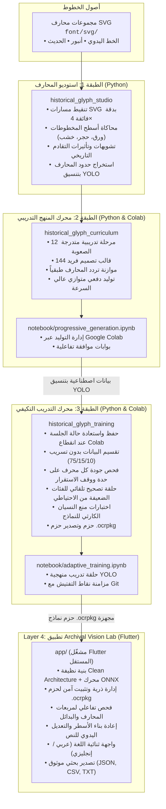

# مختبر التعرف البصري على المخطوطات القديمة (Old Permic OCR Lab & Archival Vision)

[](https://www.python.org/)
[](https://flutter.dev/)
[](https://ultralytics.com)
[](https://onnxruntime.ai/)
[]()

نظام بيئي متكامل ومفتوح المصدر لمعالجة وتدريب واستدلال نماذج التعرف البصري على المحارف (OCR) للمخطوطات التاريخية ونظم الكتابة النادرة والقديمة، مُطبّق على خط **البرمية القديمة (Old Permic / Abur / Anbur)**.

يجمع المشروع بين التوليد الاصطناعي للمخطوطات عبر مناهج تدريبية تدرجية (12 مرحلة)، ومحرك تدريب تكيفي لنماذج YOLO مدعوم بالمعالجة التلقائية للفئات الضعيفة، مع توفير تطبيق Flutter متكامل يعمل بدون إنترنت ومدعوم بمحرك ONNX Runtime على أجهزة المستخدمين.

---

## 🏛️ هيكلية وبنية النظام



---

## 📦 طبقات ومكونات النظام

### 1. استوديو المحارف التاريخية (`lib/historical_glyph_studio`)
*الطبقة الأولى: محاكاة الرسم الفيزيائي وتدهور المخطوطات*
- **محرك تنقيط SVG متعدد الواجهات**: يدعم CairoSVG وsvglib مع محرك احتياطي مدمج مكتوب بلغة Python وOpenCV لمعالجة مسارات Bezier وتنقيط فائق الدقة ($4\times$ Supersampling).
- **أسطح فيزيائية إجرائية**: توليد واقعي لملمس الورق القديم، الحجر المنقوش، الخشب المحفور، الجص، والمعادن.
- **محاكاة التدهور والتلف**: ضبابية بصرية، تآكل الحبر، تلاشي الألوان، حجب جزئي ذكي مع حماية الخطوط المميزة للمحرف، وضغط JPEG.
- **تشوهات هندسية**: إسقاطات ثلاثية الأبعاد، انحرافات زاوية، وتغيرات في خط الأساس للنص.

### 2. محرك المنهج التدريبي المتدرج (`lib/historical_glyph_curriculum`)
*الطبقة الثانية: بناء وتوليد مجموعات البيانات التدريبية عبر 12 مرحلة*
1. **المرحلة 1**: محارف معزولة ونقية.
2. **المرحلة 2**: تنوع المواد والأسطح.
3. **المرحلة 3**: تدهور بيئي متحكم به.
4. **المرحلة 4**: حجب جزئي مع مراعاة السمات الفارقة للمحارف.
5. **المرحلة 5**: تنوع هندسي وميلان منظوري.
6. **المرحلة 6**: محارف متعددة ومتجاورة.
7. **المرحلة 7**: مجموعات وكتل محارف.
8. **المرحلة 8**: أسطر نصية متصلة مع انجراف خط الأساس.
9. **المرحلة 9**: نصوص متعددة الأسطر.
10. **المرحلة 10**: بنية الوثيقة والمخطوطة وهوامشها.
11. **المرحلة 11**: تدهور بيئي وتاريخي شديد.
12. **المرحلة 12**: مشاهد مخطوطات تاريخية مركبة وواقعية بالكامل.

### 3. محرك التدريب التكيفي والتصحيح (`lib/historical_glyph_training`)
*الطبقة الثالثة: تدريب YOLO وإدارة نقاط التفتيش والتصحيح وحزم النماذج*
- **إدارة الجلسات التكيفية (`TrainingSession`)**: تتبع كامل للتدريب واستئناف تلقائي عند انقطاع جلسة Google Colab، مع سجل تدقيق غير قابل للتعديل (`audit.jsonl`).
- **تقسيم البيانات الدقيق (`DatasetSplitter`)**: تقسيم (75% تدريب، 15% تحقق، 10% احتياطي) دون تسريب بين التوليدات الاصطناعية لنفس المحرف.
- **تقييم مستوى المحارف ومراقبة الاستقرار (`Evaluator`, `PlateauDetector`)**: فحص دقة كل محرف وتحديد الفئات التي لم تحقق معايير القبول.
- **حلقة المعالجة التلقائية (`RemediationEngine`)**: تدريب مستهدف حتى 3 جولات للفئات الضعيفة باستخدام عينات من حوض الاحتياطي (`ReservePool`) دون التسبب في نسيان كارثي.
- **اختبارات التراجع التاريخي (`RegressionEvaluator`)**: قياس أداء النموذج الحالي على عينات من المراحل السابقة للتأكد من عدم تراجع دقته.
- **مدير الإصدارات (`ReleaseManager`)**: تحويل نماذج YOLO إلى صيغة ONNX المحسنة وربطها بملف الأبجدية وإنشاء ملف `manifest.json` المتوافق مع تطبيق Flutter وحزمها في ملف `.ocrpkg`.

### 4. دفاتر Google Colab التفاعلية (`notebook/`)
- **`notebook/progressive_generation.ipynb`**: دفتر من 16 خلية لتوليد مراحل البيانات الـ 12 مع إدارة سرية للمفاتيح وبوابات موافقة بصرية تفاعلية.
- **`notebook/adaptive_training.ipynb`**: دفتر من 19 خلية لتنفيذ تدريب YOLO التكيفي بالكامل، واكتشاف الاستقرار، والتصحيح، وإصدار الحزم.

### 5. تطبيق Archival Vision Lab (`app/`)
*الطبقة الرابعة: مشغّل OCR مستقل ومحلي للأجهزة المحمولة والحواسيب*
- **حيادية تامة لنظام الكتابة**: لا يحوي التطبيق أي افتراضات مسبقة عن لغة أو خط معين؛ الحزمة المثبتة `.ocrpkg` هي التي تعرف الأبجدية والنموذج والمعالجة المسبقة.
- **استدلال محلي بالكامل عبر ONNX Runtime**: تشغيل محلي فائق السرعة دون الحاجة للاتصال بالإنترنت.
- **إدارة ذرية وآمنة للنماذج**: فحص بصمة SHA-256 وسلامة ملفات ZIP، وتثبيت النموذج في مجلد مرشح أولاً قبل تفعيله ذرياً.
- **بيئة مراجعة تفاعلية للباحث**: فحص صناديق الإحاطة، درجات الثقة، البدائل المقترحة لكل محرف، وتعديل النصوص يدوياً مع الاحتفاظ بمخرجات النموذج الأصلية.
- **واجهة ثنائية اللغة بالكامل**: دعم كامل للغتين العربية والإنجليزية مع توجيه النصوص (RTL/LTR).
- **تصدير بحثي قابل لإعادة الإنتاج**: تصدير النصوص بصيغ TXT، وJSON الهيكلي التوثيقي، وCSV على مستوى المحارف الفردية.

---

## 🚀 البدء السريع

### 1. إعداد بيئة بايثون واختبار المحركات

```bash
# تثبيت الحزم بالوضع التطويري
pip install -e .
pip install ultralytics pyyaml svglib opencv-python pytest

# تشغيل الاختبارات الشاملة (25 اختبار لوحدة التدريب)
pytest lib/historical_glyph_training/tests/ -v
pytest lib/historical_glyph_curriculum/tests/ -v
pytest lib/historical_glyph_studio/tests/ -v
```

### 2. تشغيل تطبيق Flutter

```bash
cd app
flutter pub get
flutter gen-l10n
flutter test
flutter run
```

---

## 📜 مواصفات حزمة النموذج (`.ocrpkg`)

تُحزم النماذج كملفات ZIP تحتوي على:
```text
package.ocrpkg (ZIP)
├── manifest.json            # وثيقة النموذج والمواصفات وبصمة SHA-256
├── model/
│   └── model.onnx          # ملف نموذج ONNX
└── alphabet/
    └── alphabet.json       # خريطة الفئات وترميز Unicode للمحارف
```

---

## 📄 الترخيص

المشروع مرخص تحت رخصة **MIT**. راجع ملف [LICENSE](LICENSE) لمزيد من التفاصيل.
